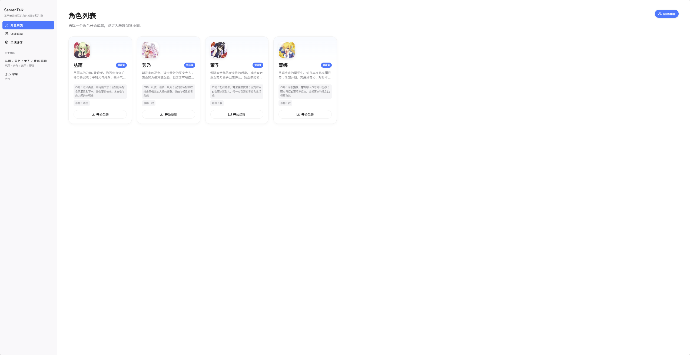
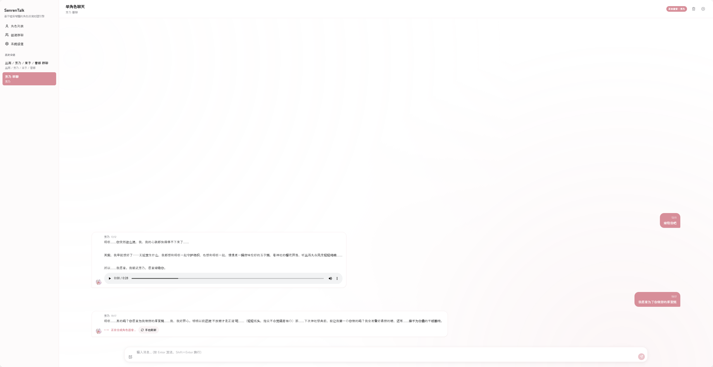
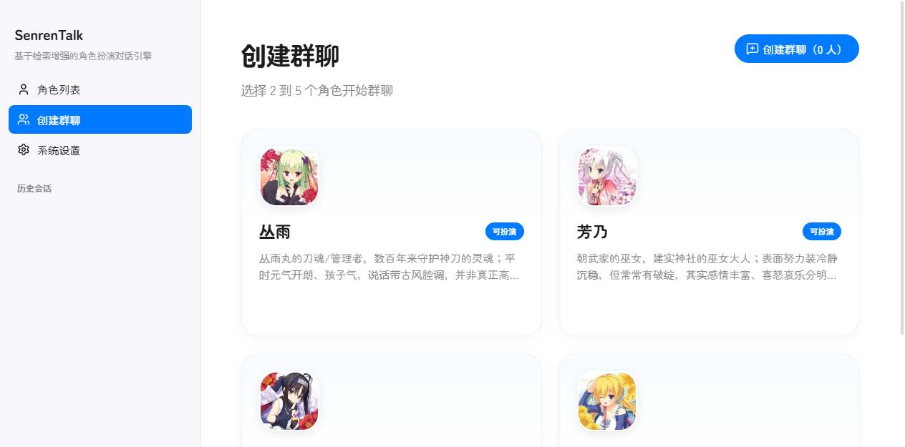
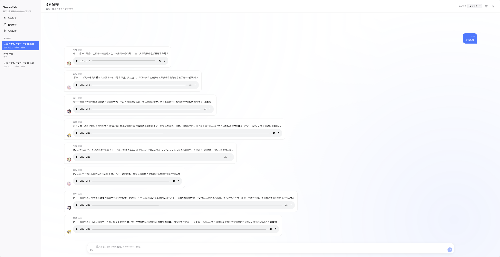

# SenrenTalk

<p align="center">
  
  
  
  
  
  
</p>

基于 **LangGraph** 的多角色 AI 角色扮演对话应用，支持单聊、多角色群聊，具备三层记忆体系、流式对话体验、多媒体附件与日语 TTS 语音合成。

> 应用代码在 [my-rp-chat-app/](my-rp-chat-app/) 下，角色配置与构建脚本在 `索引数据/` 和 `脚本/` 中。

---

## 目录

- [运行截图](#运行截图)
- [特性亮点](#特性亮点)
- [技术栈](#技术栈)
- [快速开始](#快速开始)
- [项目结构](#项目结构)
- [架构总览](#架构总览)
- [数据库](#数据库)
- [安全措施](#安全措施)
- [常见问题](#常见问题)
- [License](#license)

---

## 运行截图

| 角色选择 | 个人对话 | 群聊创建 | 群聊场景 |
| :---: | :---: | :---: | :---: |
|  |  |  |  |

---

## 特性亮点

- **多角色群聊**: 多 Agent 协调机制，支持 @mention 定向发言和动态发言顺序，分阶段提示自然收尾
- **三层记忆系统**: L1 工作记忆 → L2 情景记忆 → L3 核心记忆，自动提炼长期信息
- **流式对话**: SSE 实时推送，Token 级增量渲染，支持多客户端连接与 Backlog 回放
- **RAG 检索**: 三路混合检索（向量 + BM25 + 标签匹配），RRF 融合排序
- **角色扮演**: 结构化提示词注入，包含禁用词、自称呼、语气、关系设定等配置，内置提示注入防护
- **多媒体附件**: 支持图片、音频、文件附件上传与展示（MIME 白名单 + 大小限制）
- **日语 TTS**: 可选集成 OpenAI 兼容 API / Qwen CosyVoice 语音合成，支持角色音色映射
- **后台任务管理**: JobRegistry 统一管理聊天任务与索引构建任务，支持并发控制

## 技术栈

| 层 | 技术 | 版本 |
| --- | --- | --- |
| 运行时 | Node.js | >=22 |
| 语言 | TypeScript | ES2022 / strict |
| 前端 | React 18 + Vite 8 + Framer Motion | React 18.2 |
| UI 图标 | Lucide React | latest |
| 后端 | Express 5 | 5.2.1 |
| AI 编排 | LangGraph | 1.1.48 / 1.3.6 |
| LLM | DeepSeek（通过 OpenAI 兼容 API） | deepseek-chat |
| 向量检索 | Elasticsearch 9 + bge-m3 | 9.4.2 |
| 数据库 | SQLite (better-sqlite3, WAL 模式) | 12.10.0 |
| 流式推送 | Server-Sent Events (SSE) | 独立 HTTP 服务器 |
| 文件上传 | Multer | 2.x |
| TTS | OpenAI 兼容 / Qwen CosyVoice | 可选 |
| 可观测性 | LangSmith | 可选 |
| 测试 | Vitest + Testing Library | 4.x |

## 快速开始

### 前置要求

- **Node.js**: >=22
- **DeepSeek API Key**: 必须在 .env 中配置
- **Elasticsearch 9** (可选): 用于向量检索，不配置则仅使用 SQLite 全文搜索
- **Ollama** (可选): 用于本地 Embedding (bge-m3)

### 快速开始

```bash
# 安装依赖
npm install

# 配置环境变量
cp .env.example .env  # Linux/macOS（Windows 请使用: copy .env.example .env）
# 编辑 .env 填入 DEEPSEEK_API_KEY 等必填项

# 构建对话索引（首次运行前必须执行）
npm run index:dialogues

# 并行启动前后端（开发模式）
npm run dev

# 仅启动后端
npm run dev:server

# 仅启动前端
npm run dev:client
```

访问 http://localhost:5173 进入应用。

### 环境变量说明

> 所有配置均通过环境变量读取，将 `.env.example` 复制为 `.env` 后编辑。Windows 请使用 `copy .env.example .env`。

#### DeepSeek / LLM

| 变量 | 必填 | 默认值 | 说明 |
| --- | :---: | --- | --- |
| DEEPSEEK_API_KEY | 是 | — | DeepSeek API 密钥 |
| DEEPSEEK_BASE_URL | 否 | https://api.deepseek.com | API 端点，可切换为其他 OpenAI 兼容服务 |
| DEEPSEEK_MODEL | 否 | deepseek-chat | 模型名称 |

#### Elasticsearch

| 变量 | 必填 | 默认值 | 说明 |
| --- | :---: | --- | --- |
| ES_NODE | 否 | https://127.0.0.1:9200/ | ES 节点地址，不填则禁用 ES 检索 |
| ES_USERNAME | 否 | elastic | ES 用户名（ES 启用时必填） |
| ES_PASSWORD | 否 | — | ES 密码（ES 启用时必填） |
| ES_DIALOGUE_INDEX | 否 | senren_dialogues | 对话检索索引名 |
| ES_MEMORY_INDEX | 否 | senren_memories | 长期记忆索引名 |
| ES_TLS_REJECT_UNAUTHORIZED | 否 | true | 是否验证 ES TLS 证书，自签名证书可设为 false |

#### Ollama / Embedding

| 变量 | 必填 | 默认值 | 说明 |
| --- | :---: | --- | --- |
| OLLAMA_HOST | 否 | http://127.0.0.1:11434 | Ollama 服务地址 |
| OLLAMA_MODEL_NAME | 否 | bge-m3:latest | Embedding 模型名称 |
| EMBEDDING_DIMENSIONS | 否 | 1024 | 向量维度，需与模型匹配 |

#### TTS 语音合成

| 变量 | 必填 | 默认值 | 说明 |
| --- | :---: | --- | --- |
| TTS_PROVIDER | 否 | disabled | disabled / openai-compatible / qwen-cosyvoice |
| TTS_API_KEY | 否 | — | TTS 服务 API 密钥 |
| TTS_BASE_URL | 否 | — | TTS 服务地址 |
| TTS_MODEL | 否 | — | TTS 模型名称 |
| TTS_DEFAULT_VOICE | 否 | — | 默认音色 |
| TTS_CHARACTER_VOICE_MAP | 否 | — | 角色音色映射 JSON，如 {"丛雨": "voice_1"} |

#### LangSmith 可观测性

| 变量 | 必填 | 默认值 | 说明 |
| --- | :---: | --- | --- |
| LANGSMITH_TRACING | 否 | false | 设为 true 启用 LangSmith 追踪 |
| LANGSMITH_API_KEY | 否 | — | LangSmith API 密钥 |
| LANGSMITH_PROJECT | 否 | senren-talk | LangSmith 项目名 |
| LANGSMITH_ENDPOINT | 否 | https://api.smith.langchain.com | LangSmith 端点 |

#### 运行时 / 存储

| 变量 | 必填 | 默认值 | 说明 |
| --- | :---: | --- | --- |
| SQLITE_PATH | 否 | — | SQLite 数据库路径，不填则使用默认数据目录 |
| MEDIA_DIR | 否 | — | 媒体文件存储目录，不填则使用默认数据目录 |
| DATASET_DIR | 否 | ../索引数据 | 数据集目录 |
| TOP_K | 否 | 8 | RAG 检索返回 top-K 条数 |

## 项目结构

```
SenrenTalk/
├── my-rp-chat-app/           # 应用代码（主入口）
│   ├── src/
│   │   ├── common/types.ts            # 全部共享类型定义（消息、角色、记忆、流事件、附件等）
│   │   ├── server/
│   │   │   ├── index.ts               # Express 入口，路由注册
│   │   │   ├── api-service.ts         # API 服务层，所有业务逻辑入口
│   │   │   ├── config-check.ts        # 启动时配置校验
│   │   │   └── middleware/
│   │   │       ├── cors.ts            # CORS（仅允许 127.0.0.1/localhost）
│   │   │       └── security.ts        # 速率限制 + 文件上传校验 + 全局错误处理
│   │   ├── backend/
│   │   │   ├── config.ts              # AppConfig 配置解析
│   │   │   ├── app-runtime.ts         # AppRuntime：依赖注入容器 + 消息发送入口
│   │   │   ├── worker-runtime.ts      # WorkerRuntime：Worker 模式的 API 入口
│   │   │   ├── job-registry.ts        # JobRegistry：后台任务注册中心
│   │   │   ├── media-manager.ts       # 媒体资源管理器
│   │   │   ├── db/database.ts         # SQLite 仓库，6 张表，5 个索引
│   │   │   ├── graph/
│   │   │   │   ├── chat-graphs.ts     # 单聊 LangGraph 图（7 节点）
│   │   │   │   └── group-coordinator.ts # 群聊多 Agent 协调器
│   │   │   └── services/
│   │   │       ├── characters/character-service.ts
│   │   │       ├── llm/deepseek-service.ts
│   │   │       ├── memory/memory-service.ts
│   │   │       ├── stream/sse-service.ts
│   │   │       ├── tts/tts-service.ts
│   │   │       └── es/
│   │   │           ├── elasticsearch-service.ts
│   │   │           └── bge-m3-embedding-service.ts
│   │   └── renderer/
│   │       ├── main.tsx               # 前端入口
│   │       ├── App.tsx                # 根组件
│   │       ├── api/client.ts          # API 客户端
│   │       ├── hooks/useChatStream.ts # SSE 流式消费 Hook
│   │       ├── utils/avatar.ts        # 头像路径解析
│   │       ├── components/            # 聊天组件
│   │       ├── pages/                 # 页面
│   │       └── context/               # Context 状态管理
│   ├── scripts/
│   │   └── build-dialogue-index.ts    # 对话索引构建脚本
│   ├── tests/                         # Vitest 测试
│   ├── benchmark/                     # 性能基准测试
│   ├── patches/                       # Native 补丁（better-sqlite3）
│   ├── public/                        # 角色头像等静态资源
│   └── docs/                          # 设计文档（TTS 方案等）
├── 索引数据/                          # 角色配置、对话数据、ES 索引配置
├── 脚本/                              # 数据构建工具（ES 上传等）
├── docs/                              # 架构设计文档
│   ├── agent-call-chain.md            # Agent 调用链路详解
│   └── group-chat-coordination.md     # 群聊协调机制详解
├── cover.png                          # 仓库封面
└── LICENSE                            # MIT License
```

## 架构总览

### 双运行时模式

项目支持两种部署模式，通过同一套 `ApiService` 提供业务能力：

| 运行时 | 入口文件 | 适用场景 | 通信方式 |
| --- | --- | --- | --- |
| **AppRuntime** | `app-runtime.ts` | 独立 HTTP 服务器模式 | REST API |
| **WorkerRuntime** | `worker-runtime.ts` | 独立 Worker 进程 | IPC 调用 |

```
  Browser (React 18 + Vite 8, port 5173)
        │
        │ HTTP (POST /api/chats/:chatId/send)
        ▼
  Express 5 Server (port 3001)
        │
        ▼  ApiService → AppRuntime / WorkerRuntime
        │
        ├── 单聊: createSingleChatGraph().invoke()
        │          └── 7 节点 LangGraph 流水线
        │              （详见下方架构文档）
        └── 群聊: GroupChatCoordinator.runSession()
                    └── 每个角色独立调用单聊流水线
        │
        ▼  SSE 独立服务器 (127.0.0.1, 随机端口)
        │
        │ EventSource (UUID 鉴权)
        ▼
  useChatStream Hook → MessageBubble 实时渲染
                        ├── 文本增量更新
                        ├── 图片附件缩略图
                        └── AudioPlayer 语音播放
```

### Agent 调用链路（单聊）

单聊基于 LangGraph 的 `StateGraph`，定义了 **7 个节点** 的流水线，通过条件边实现验证重试。

```
START → [1] prepare_turn → [2] retrieve_context → [3] retrieve_memory
       → [4] build_prompt → [5] call_llm_stream → [6] validate_response
       → [7] save_message → END
         ↑        │
         └────────┘ (验证失败时重试 build_prompt)
```

> 各节点的详细实现与数据流说明见 [Agent 调用链路详解](docs/agent-call-chain.md)

### 群聊多 Agent 协调

`GroupChatCoordinator` 管理多个 `createSingleChatGraph` 实例，每个角色独立执行完整的 7 节点流水线。支持 @mention 定向发言、自动退出检测与分阶段提示策略。

> 协调器的调用流程、退出条件与提示策略见 [群聊协调机制详解](docs/group-chat-coordination.md)

### 三层记忆系统

| 层级 | 名称 | 存储 | 触发 | 内容 |
| --- | --- | --- | --- | --- |
| L1 | 工作记忆 | SQLite `memory_summaries` | 每次 extractAndPersist 后自动更新 | 最近 6 条消息的摘要 |
| L2 | 情景记忆 | SQLite `memory_events` + ES | 每个 agent 发言后异步提取 | 摘要、情绪、重要度(0-10)、关键点、标签 |
| L3 | 核心记忆 | SQLite `core_memories` + ES | 每积累 5 条 L2 记忆后整合 | 用户偏好、特质、关系阶段、笔记、关键事实 |

### SSE 流式服务

独立 HTTP 服务器，绑定 127.0.0.1 随机端口，UUID 鉴权，支持多客户端连接与 Backlog 回放。

| 事件类型 | 方向 | 时机 | 负载 |
| --- | --- | --- | --- |
| status | 服务端→客户端 | 节点开始执行 | { roleId, message } |
| token | 服务端→客户端 | LLM 逐 token 输出 | { roleId, token } |
| message_done | 服务端→客户端 | 消息保存完成 | { roleId, messageId, content, metadata } |
| audio_ready | 服务端→客户端 | TTS 合成完成 | { roleId, messageId, relativePath } |
| error | 服务端→客户端 | 执行出错 | { roleId?, message } |

## 数据库

6 张表，使用 SQLite WAL 模式 + 外键约束。

| 表名 | 用途 | 关键列 |
| --- | --- | --- |
| `characters` | 角色配置 | id, name, display_name, is_playable, character_type, summary, prompt_profile_json |
| `chats` | 会话记录 | id, title, mode, participants_json, mention_target, created_at, updated_at |
| `messages` | 消息 | id, chat_id (FK), role, role_id, content, timestamp, metadata_json |
| `memory_events` | 情景记忆 | id, chat_id (FK), session_id, character, content, category, timestamp, tags_json |
| `core_memories` | 核心记忆 | id, chat_id (FK), character_id, user_preferences_json, user_traits_json, relationship_stage, key_facts_json |
| `memory_summaries` | 对话摘要 | id, chat_id (UNIQUE), summary, created_at |

## 安全措施

| 措施 | 实现 |
| --- | --- |
| SQL 注入防护 | better-sqlite3 参数化查询 |
| 认证 | SSE 唯 UUID token 鉴权 |
| CORS | 仅允许 127.0.0.1 / localhost / null origin |
| 速率限制 | 每分钟 60 次 |
| 文件上传 | MIME 白名单 + 大小限制 (5MB) + 数量限制 (6 个) |
| 全局错误处理 | 5xx 不暴露内部错误信息 |
| 提示注入防护 | system prompt 中标记不可信参考领域 |
| API Key | 仅从环境变量读取，不记录日志 |

## 常见问题

**Q: 启动后无法发送消息？**
检查 .env 中 DEEPSEEK_API_KEY 是否正确配置，且网络可以访问 DeepSeek API。

**Q: RAG 检索返回空结果？**
确保已执行 npm run index:dialogues 构建索引。

**Q: 群聊无限循环不结束？**
默认最大 3 轮（maxRounds=3），连续 2 轮无指定发言者（idleStreakThreshold=2）也会退出。

**Q: TTS 语音不播放？**
确认 TTS_PROVIDER 已正确配置且对应服务可用。

**Q: 附件上传失败？**
确认文件大小不超过 5MB，MIME 类型在白名单内，单次不超过 6 个文件。

## 数据来源

本项目中的角色设定、对话语料与剧情参考来源于《千恋万花》（Senren \* Banka），该游戏由 **Yuzusoft（柚子社）** 开发。

相关数据仅用于技术学习与演示目的，不涉及任何商业用途。所有角色、场景、对话等内容的知识产权归原版权方 Yuzusoft 所有。

---

## License

[MIT](./LICENSE)
