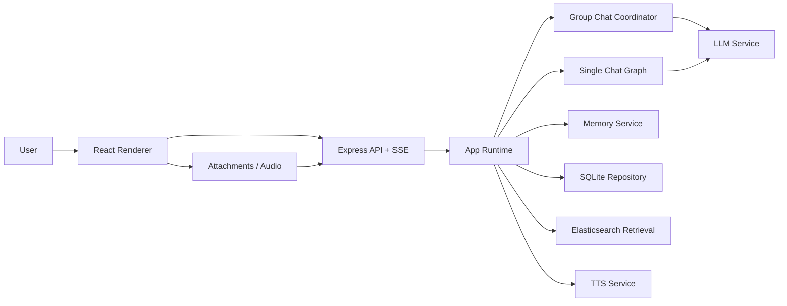

# SenrenTalk

<p align="center">
  
  
  
  
  
  
</p>

<p align="center">
  A roleplay-focused AI chat application built around character consistency, memory, group chat orchestration, image understanding, and voice companionship.
</p>

## What It Is

SenrenTalk is a multi-character AI roleplay project inspired by `Senren * Banka`.

The app is built for immersive character conversation rather than generic assistant chat. Its core focus is:

- keeping each character in role
- supporting both 1-on-1 chat and multi-character rooms
- preserving memory across turns
- handling image-based context
- making the chat feel closer to a voiced companion experience

The main application lives in [my-rp-chat-app](./my-rp-chat-app/). Character data, retrieval assets, and helper scripts are stored alongside it in this repository.

## Highlights

- Single chat and group chat for multiple RP characters
- Character guardrails for tone, self-reference, relationship, and OOC boundaries
- Layered memory with summaries, episodic memories, and core relationship state
- Retrieval-enhanced dialogue support with SQLite and Elasticsearch
- Image attachments for identity-sensitive multimodal conversations
- SSE-based streaming responses
- Japanese TTS support for character voice playback
- Group Chat V2 room model with visible round state, reply targets, and anti-repeat protection

## Architecture


```mermaid
flowchart LR
    U["User"] --> UI["React Renderer"]
    UI --> API["Express API + SSE"]
    API --> RT["App Runtime"]
    RT --> GC["Group Chat Coordinator"]
    RT --> SC["Single Chat Graph"]
    GC --> LLM["LLM Service"]
    SC --> LLM
    RT --> MEM["Memory Service"]
    RT --> DB["SQLite Repository"]
    RT --> ES["Elasticsearch Retrieval"]
    RT --> TTS["TTS Service"]
    UI --> MEDIA["Attachments / Audio"]
    MEDIA --> API
```

## Group Chat V2

The current group chat direction is no longer just "several characters replying in sequence". It is being shaped into a room-based experience.

### V2 goals

- visible room mode and round state
- clearer "who is replying to whom"
- no accidental extra round by default
- better pacing and fewer repetitive follow-up replies
- targeted speaking and room-level control

### Room modes

- `single_round`: the default mode; each participant replies at most once
- `free_chat`: allows follow-up turns within explicit round and message budgets
- `host_mode`: a host character leads, cues, and closes the room

## Project Structure

```text
SenrenTalk/
|-- my-rp-chat-app/         # Main application
|   |-- src/
|   |   |-- backend/        # Runtime, graph orchestration, memory, retrieval, TTS
|   |   |-- common/         # Shared types
|   |   |-- renderer/       # React UI
|   |   `-- server/         # Express entry and API layer
|   `-- tests/              # Vitest test suite
|-- docs/                   # Design notes and technical docs
|-- 索引数据/               # Character and retrieval-related assets
|-- 脚本/                   # Helper scripts
`-- README.md
```

## Tech Stack

| Layer | Stack |
| --- | --- |
| Frontend | React 18, Vite, Framer Motion |
| Backend | Node.js, Express 5, TypeScript |
| Orchestration | LangGraph |
| Model Access | OpenAI-compatible API |
| Storage | SQLite |
| Retrieval | Elasticsearch |
| Streaming | SSE |
| Testing | Vitest, Testing Library |

## Core Capabilities

### Character consistency

- persona constraints are injected into prompts
- relationship and address rules are preserved across dialogue
- post-generation validation helps catch obvious OOC output

### Memory layers

- L1: conversation summary
- L2: episodic memory events
- L3: core memory and relationship state

### Multimodal input

- users can attach images with messages
- the system applies extra checks for "who is in the image" style questions
- regression tests cover identity-confusion edge cases

### Streaming experience

- responses are streamed over SSE
- group chat now emits room-level events such as round plan, skipped roles, and room finished

## Quick Start

### Requirements

- Node.js `22+`
- an available LLM API key
- optional: Elasticsearch
- optional: a local or remote embedding service

### Install

Run inside `my-rp-chat-app/`:

```bash
npm install
```

If PowerShell has trouble calling `npm`, use:

```bash
npm.cmd install
```

### Environment

Copy the example file:

```bash
cp .env.example .env
```

On Windows, you can also duplicate `my-rp-chat-app/.env.example` manually and rename it to `.env`.

Common variables:

| Variable | Purpose |
| --- | --- |
| `LLM_API_KEY` | API key for the model provider |
| `LLM_BASE_URL` | OpenAI-compatible base URL |
| `LLM_MODEL` | Main text model |
| `LLM_VISION_MODEL` | Vision-capable model |
| `ES_NODE` | Elasticsearch endpoint |
| `ES_USERNAME` / `ES_PASSWORD` | Elasticsearch credentials |
| `OLLAMA_HOST` | Embedding service host |
| `OLLAMA_MODEL_NAME` | Embedding model name |
| `SQLITE_PATH` | SQLite file path |
| `MEDIA_DIR` | Media directory |
| `DATASET_DIR` | Defaults to `../索引数据` |
| `TTS_PROVIDER` | Active TTS provider |

### Run

```bash
cd my-rp-chat-app
```

Start development mode:

```bash
npm run dev
```

If needed in PowerShell:

```bash
npm.cmd run dev
```

Typical local addresses:

- frontend: `http://localhost:5173`
- backend: `http://127.0.0.1:3001`

Run only the backend:

```bash
npm run start
```

## Common Commands

```bash
# Development
npm.cmd run dev

# Backend only
npm.cmd run start

# Type check
npm.cmd run typecheck

# Tests
npm.cmd run test

# Frontend build
npm.cmd run build

# Build dialogue index
npm.cmd run index:dialogues
```

## Quality and Testing

The test suite covers:

- single-chat graph behavior
- group chat coordination
- database persistence and migration
- LLM service wrappers
- streaming consumption on the frontend
- OOC boundary cases
- image identity scenarios

Recommended before pushing changes:

```bash
npm.cmd run typecheck
npm.cmd run test
```

## Documentation

- App note: [my-rp-chat-app/README.md](./my-rp-chat-app/README.md)
- Agent call chain: [docs/agent-call-chain.md](./docs/agent-call-chain.md)
- Group chat coordination: [docs/group-chat-coordination.md](./docs/group-chat-coordination.md)

## Notes

- In this environment, `npm.cmd` may work more reliably than plain `npm` under PowerShell.
- Disabling Elasticsearch TLS verification may help local development, but it is not suitable for production.
- Image understanding is improved with identity checks, but ambiguous images and deliberately misleading prompts still need careful handling.

## Disclaimer

Character settings, dialogue materials, and story references in this repository are derived from `Senren * Banka`, whose original rights belong to Yuzusoft.

This repository is intended for learning, research, and technical demonstration. Please do not use copyrighted source material in unauthorized commercial scenarios.

## License

[MIT](./LICENSE)
