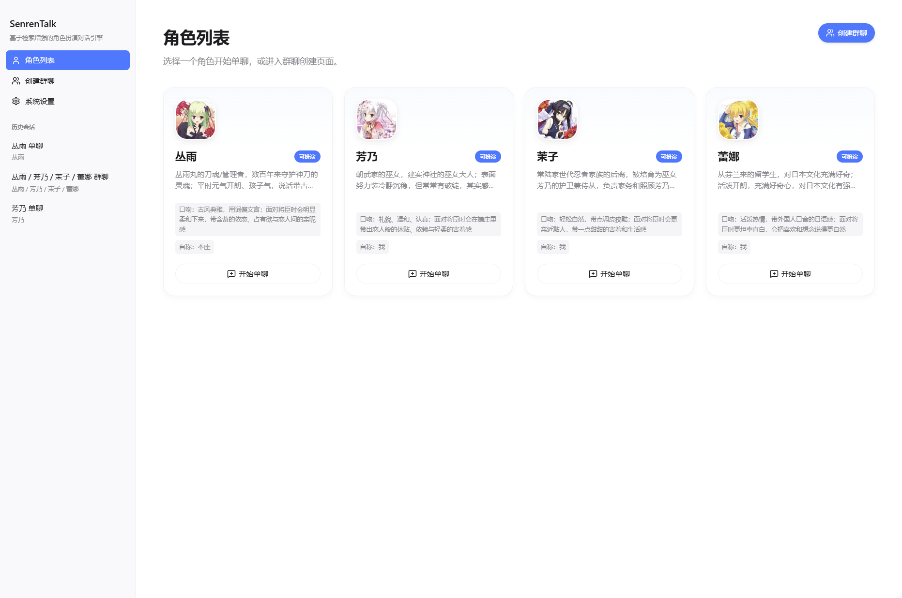
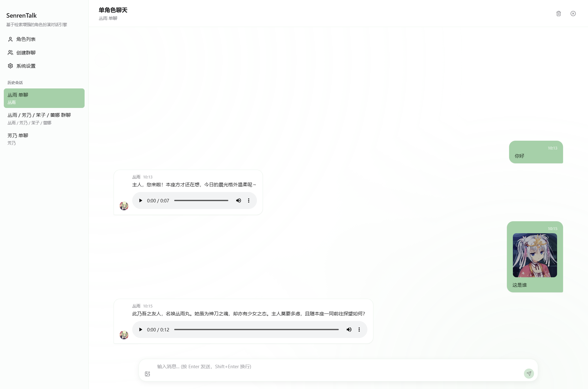
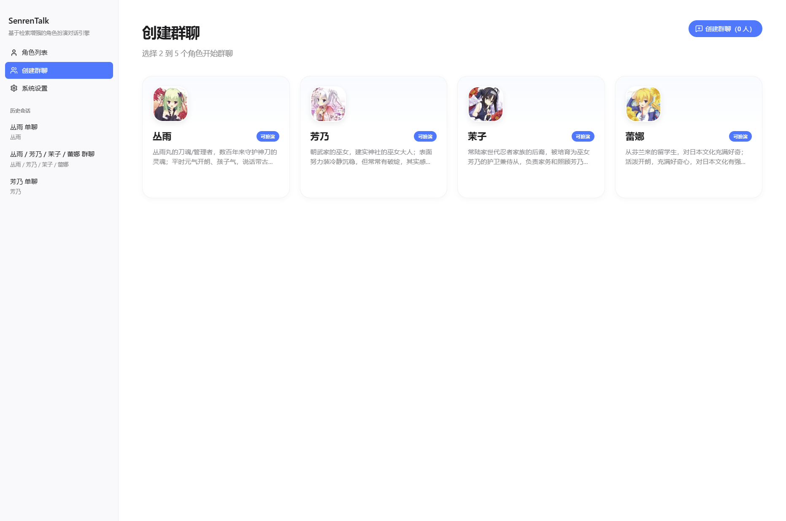
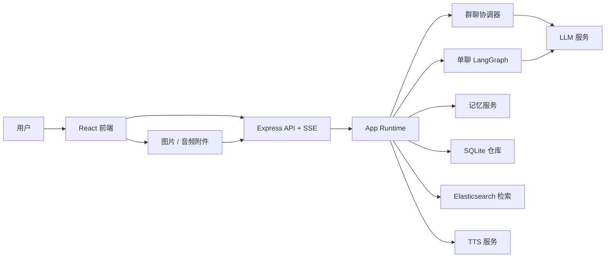
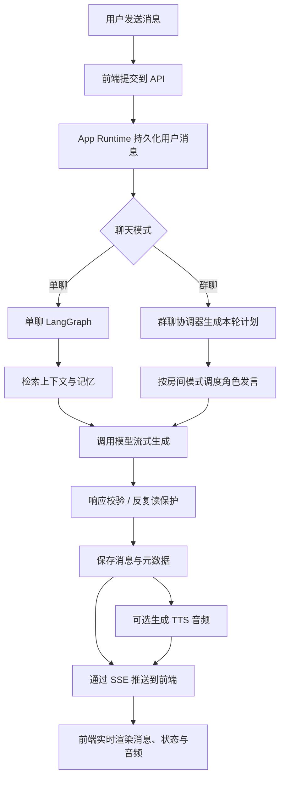

# SenrenTalk

<p align="center">
  
  
  
  
  
  
</p>

<p align="center">
  面向角色扮演场景的 AI 对话应用，强调角色一致性、群聊房间感、记忆延续、多模态理解与语音陪伴体验。
</p>

## 项目简介

SenrenTalk 是一个以 `千恋万花（Senren * Banka）` 角色扮演体验为灵感来源的多角色 AI 对话项目。

它不是通用型助手聊天产品，而是更偏向沉浸式角色陪伴与角色群聊体验。当前项目重点放在：

- 让角色持续保持人设与语气一致
- 支持单聊与多角色群聊
- 让对话具备可延续的记忆
- 支持图片输入与身份敏感场景理解
- 提供更接近语音陪伴的聊天体验

主应用位于 [my-rp-chat-app](./my-rp-chat-app/)，角色数据、检索资产和辅助脚本与应用代码一起保存在本仓库中。

## 运行截图

### 角色列表



### 单人聊天



### 群聊创建页



## 核心亮点

- 支持单聊与多角色群聊，适合角色扮演型互动
- 角色约束覆盖语气、自称、关系、禁用词、越界控制等关键维度
- 三层记忆结构支持长期关系与阶段性情境延续
- 检索增强结合 SQLite 与 Elasticsearch，提升角色知识召回能力
- 支持图片附件，在“图中是谁”“是不是你”这类场景中做额外约束
- 基于 SSE 的流式输出体验
- 支持日语 TTS 与角色音色映射
- 群聊 V2 已进入房间化改造，支持轮次状态、定向发言与反复读保护

## 架构图


```mermaid
flowchart LR
    U["用户"] --> UI["React 前端"]
    UI --> API["Express API + SSE"]
    API --> RT["App Runtime"]
    RT --> GC["群聊协调器"]
    RT --> SC["单聊 LangGraph"]
    GC --> LLM["LLM 服务"]
    SC --> LLM
    RT --> MEM["记忆服务"]
    RT --> DB["SQLite 仓库"]
    RT --> ES["Elasticsearch 检索"]
    RT --> TTS["TTS 服务"]
    UI --> MEDIA["图片 / 音频附件"]
    MEDIA --> API
```

## 功能流程图


```mermaid
flowchart TD
    A["用户发送消息"] --> B["前端提交到 API"]
    B --> C["App Runtime 持久化用户消息"]
    C --> D{"聊天模式"}
    D -->|单聊| E["单聊 LangGraph"]
    D -->|群聊| F["群聊协调器生成本轮计划"]
    E --> G["检索上下文与记忆"]
    F --> H["按房间模式调度角色发言"]
    G --> I["调用模型流式生成"]
    H --> I
    I --> J["响应校验 / 反复读保护"]
    J --> K["保存消息与元数据"]
    K --> L["可选生成 TTS 音频"]
    K --> M["通过 SSE 推送到前端"]
    L --> M
    M --> N["前端实时渲染消息、状态与音频"]
```

## 群聊 V2

当前群聊方向不再只是“几个角色顺序回复”，而是逐步升级为“有模式、有状态、有节奏的房间”。

### 目标

- 用户能看懂当前是哪个房间模式
- 用户能看懂谁在回应谁
- 默认不再意外多跑一轮
- 降低机械接话和高频复读
- 让群聊具备明确的节奏控制能力

### 房间模式

- `single_round`：默认模式，每个角色本轮最多回复一次
- `free_chat`：允许继续接话，但必须受轮次和消息预算约束
- `host_mode`：由主持角色串场、点名、收尾

## 目录结构

```text
SenrenTalk/
|-- my-rp-chat-app/         # 主应用
|   |-- src/
|   |   |-- backend/        # 运行时、图编排、记忆、检索、TTS
|   |   |-- common/         # 前后端共享类型
|   |   |-- renderer/       # React 前端
|   |   `-- server/         # Express 服务入口与 API
|   `-- tests/              # Vitest 测试
|-- docs/                   # 设计与实现文档
|-- 索引数据/               # 角色数据与检索资产
|-- 脚本/                   # 辅助脚本
`-- README.md
```

## 技术栈

| 层 | 技术 |
| --- | --- |
| 前端 | React 18, Vite, Framer Motion |
| 后端 | Node.js, Express 5, TypeScript |
| 编排 | LangGraph |
| 模型接入 | OpenAI 兼容 API |
| 存储 | SQLite |
| 检索 | Elasticsearch |
| 流式通信 | SSE |
| 测试 | Vitest, Testing Library |

## 核心能力

### 角色一致性

- 将角色设定约束注入系统提示词
- 保留称呼、关系、语气、自称等细节
- 在生成后做基础校验，拦截明显 OOC 输出

### 三层记忆

- L1：对话摘要
- L2：情景记忆事件
- L3：核心记忆与关系状态

### 多模态输入

- 支持图片随消息发送
- 对身份识别类问题做额外提示和一致性控制
- 已补充相关回归测试，降低角色误认概率

### 流式体验

- 消息通过 SSE 实时推送
- 群聊额外提供轮次计划、跳过角色、房间结束等状态事件

## 快速开始

### 环境要求

- Node.js `22+`
- 可用的 LLM API Key
- 可选：Elasticsearch
- 可选：本地或远程 Embedding 服务

### 安装依赖

进入 `my-rp-chat-app/` 后执行：

```bash
npm install
```

如果 PowerShell 下 `npm` 调用异常，可以使用：

```bash
npm.cmd install
```

### 环境变量

复制示例文件：

```bash
cp .env.example .env
```

Windows 下也可以直接复制 `my-rp-chat-app/.env.example` 并重命名为 `.env`。

常用变量如下：

| 变量 | 说明 |
| --- | --- |
| `LLM_API_KEY` | 模型服务 API Key |
| `LLM_BASE_URL` | OpenAI 兼容接口地址 |
| `LLM_MODEL` | 文本模型 |
| `LLM_VISION_MODEL` | 图像理解模型 |
| `ES_NODE` | Elasticsearch 地址 |
| `ES_USERNAME` / `ES_PASSWORD` | Elasticsearch 认证信息 |
| `OLLAMA_HOST` | Embedding 服务地址 |
| `OLLAMA_MODEL_NAME` | Embedding 模型名 |
| `SQLITE_PATH` | SQLite 文件路径 |
| `MEDIA_DIR` | 媒体文件目录 |
| `DATASET_DIR` | 默认为 `../索引数据` |
| `TTS_PROVIDER` | 当前启用的 TTS 提供方 |

### 启动项目

```bash
cd my-rp-chat-app
```

启动开发模式：

```bash
npm run dev
```

PowerShell 下可改用：

```bash
npm.cmd run dev
```

默认情况下：

- 前端：`http://localhost:5173`
- 后端：`http://127.0.0.1:3001`

仅启动后端：

```bash
npm run start
```

## 常用命令

```bash
# 开发模式
npm.cmd run dev

# 仅后端
npm.cmd run start

# 类型检查
npm.cmd run typecheck

# 运行测试
npm.cmd run test

# 构建前端
npm.cmd run build

# 构建对话索引
npm.cmd run index:dialogues
```

## 测试与质量

当前测试覆盖：

- 单聊图编排
- 群聊协调逻辑
- 数据库持久化与迁移
- LLM 服务封装
- 前端流式消费
- OOC 边界场景
- 图片身份识别相关场景

建议在提交前至少执行：

```bash
npm.cmd run typecheck
npm.cmd run test
```

## 文档入口

- 应用说明：[my-rp-chat-app/README.md](./my-rp-chat-app/README.md)
- 单聊调用链路：[docs/agent-call-chain.md](./docs/agent-call-chain.md)
- 群聊协调说明：[docs/group-chat-coordination.md](./docs/group-chat-coordination.md)

## 注意事项

- 在当前 PowerShell 环境里，`npm.cmd` 可能比直接调用 `npm` 更稳定
- 开发环境下可以临时放宽 Elasticsearch TLS 校验，但不适合生产环境
- 图片理解能力已增加身份一致性控制，但面对多人物、遮挡、低清图和误导性提问时仍需谨慎

## 版权说明

本项目中的角色设定、对话素材与剧情参考来源于 `千恋万花（Senren * Banka）`，其原始版权归 Yuzusoft 所有。

本仓库仅用于学习、研究与技术演示，请勿将受版权保护的原始内容用于未经授权的商业用途。

## License

[MIT](./LICENSE)
