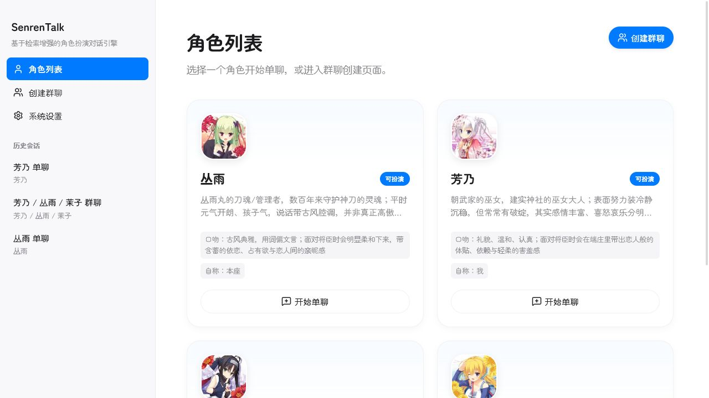
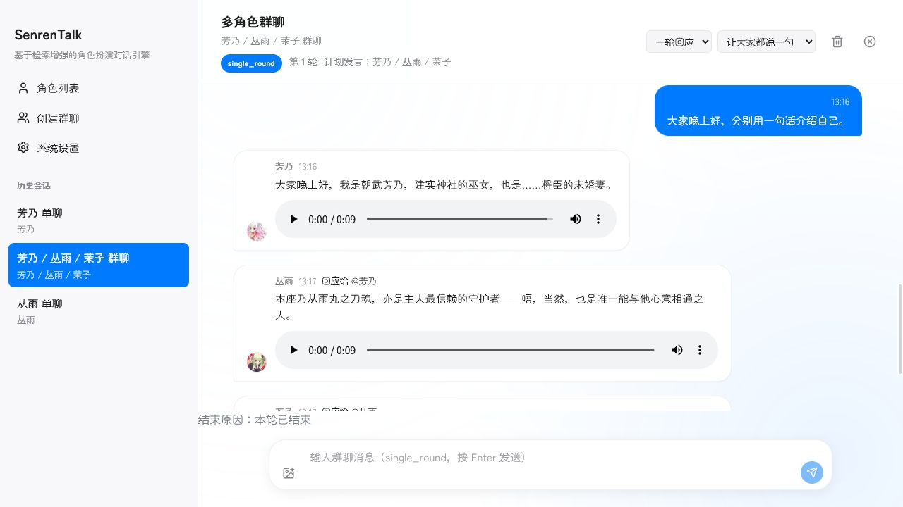
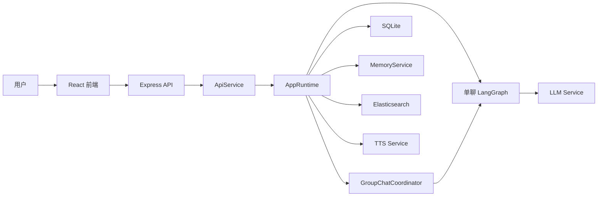
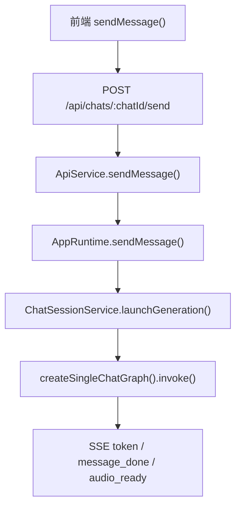
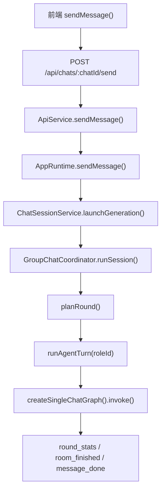

# SenrenTalk

<p align="center">
  
  
  
  
  
  
</p>

<p align="center">
  面向角色扮演场景的 AI 对话应用，强调角色一致性、群聊房间感、记忆延续、多模态理解与语音陪伴体验。
</p>

## 项目简介

SenrenTalk 是一个以《千恋＊万花（Senren * Banka）》角色扮演体验为灵感来源的多角色 AI 对话项目。

它不是通用助手型聊天产品，而是更偏向：

- 角色陪伴
- 角色群聊
- 长期关系与记忆延续
- 图片参与下的角色判断与回应
- 更接近语音陪伴的互动体验

主应用位于 [my-rp-chat-app](./my-rp-chat-app/)。

## 文档入口

如果你是第一次看这个仓库，建议按下面顺序阅读：

1. 当前 README：了解整体结构、运行方式和能力边界
2. [docs/agent-call-chain.md](./docs/agent-call-chain.md)：看单聊调用链路
3. [docs/group-chat-coordination.md](./docs/group-chat-coordination.md)：看群聊协调器
4. [my-rp-chat-app/README.md](./my-rp-chat-app/README.md)：看应用目录入口

文档分工如下：

- 根 README：项目总览、架构、环境、运行方式
- `docs/agent-call-chain.md`：单聊请求如何进入 LangGraph 并完成回复
- `docs/group-chat-coordination.md`：群聊如何规划轮次、调度角色和防止复读
- `my-rp-chat-app/README.md`：应用目录导航，不重复维护长说明

## 运行截图

### 2026-07-08 实机启动验证

- 启动方式：在 `my-rp-chat-app/` 中执行 `npm.cmd run dev`
- 验证模式：临时使用 `ES_ENABLED=false`、`TTS_PROVIDER=disabled` 跑通最小可用链路
- 完成操作：打开角色列表，进入 `single_round` 群聊，发送真实消息，等待三位角色依次完成回复
- 验证结果：房间以“本轮已结束”收尾，没有继续多跑额外轮次

### 实测首页



### 实测群聊完成页



### 角色列表


### 单人聊天


### 群聊创建页


## 核心亮点

- 支持单聊与多角色群聊，适合角色扮演型互动
- 角色约束覆盖语气、自称、关系、禁用词、越界控制等关键维度
- 三层记忆结构支持长期关系与阶段性情境延续
- 检索增强结合 SQLite 与 Elasticsearch，提升角色知识召回能力
- 支持图片附件，在“图中是谁”“是不是你”这类场景中做额外约束
- 基于 SSE 的流式输出体验
- 支持日语 TTS 与角色音色映射
- 群聊 V2 已进入房间化改造，支持轮次状态、定向发言与反复读保护

## 架构总览


```mermaid
flowchart LR
    U["用户"] --> UI["React 前端"]
    UI --> API["Express API"]
    API --> AS["ApiService"]
    AS --> RT["AppRuntime"]
    RT --> SC["单聊 LangGraph"]
    RT --> GC["GroupChatCoordinator"]
    RT --> DB["SQLite"]
    RT --> MEM["MemoryService"]
    RT --> ES["Elasticsearch"]
    RT --> TTS["TTS Service"]
    SC --> LLM["LLM Service"]
    GC --> SC
```

这张图只描述“模块关系”。  
如果你想看请求真正如何流动，请直接看下面两份细化文档：

- 单聊调用链路：[docs/agent-call-chain.md](./docs/agent-call-chain.md)
- 群聊协调说明：[docs/group-chat-coordination.md](./docs/group-chat-coordination.md)

## 请求流向

### 单聊


```mermaid
flowchart TD
    A["前端 sendMessage()"] --> B["POST /api/chats/:chatId/send"]
    B --> C["ApiService.sendMessage()"]
    C --> D["AppRuntime.sendMessage()"]
    D --> E["ChatSessionService.launchGeneration()"]
    E --> F["createSingleChatGraph().invoke()"]
    F --> G["SSE token / message_done / audio_ready"]
```

详细说明见：

- [docs/agent-call-chain.md](./docs/agent-call-chain.md)

### 群聊


```mermaid
flowchart TD
    A["前端 sendMessage()"] --> B["POST /api/chats/:chatId/send"]
    B --> C["ApiService.sendMessage()"]
    C --> D["AppRuntime.sendMessage()"]
    D --> E["ChatSessionService.launchGeneration()"]
    E --> F["GroupChatCoordinator.runSession()"]
    F --> G["planRound()"]
    G --> H["runAgentTurn(roleId)"]
    H --> I["createSingleChatGraph().invoke()"]
    I --> J["round_stats / room_finished / message_done"]
```

详细说明见：

- [docs/group-chat-coordination.md](./docs/group-chat-coordination.md)

## 群聊 V2

当前群聊方向不再只是“几个角色顺序回复”，而是逐步升级为“有模式、有状态、有节奏的房间”。

### 目标

- 用户能看懂当前是哪种房间模式
- 用户能看懂谁在回应谁
- 默认不再意外多跑一轮
- 降低机械接话和高频复读
- 让群聊具备明确的节奏控制能力

### 房间模式

- `single_round`：默认模式，每个角色本轮最多回复一次
- `free_chat`：允许继续接话，但必须受轮次和消息预算约束
- `host_mode`：由主持角色串场、点名、收尾

群聊实现细节已单独整理在：

- [docs/group-chat-coordination.md](./docs/group-chat-coordination.md)

## 目录结构

```text
SenrenTalk/
|-- my-rp-chat-app/         # 主应用
|   |-- src/
|   |   |-- backend/        # 运行时、图编排、记忆、检索、TTS
|   |   |-- common/         # 前后端共享类型
|   |   |-- renderer/       # React 前端
|   |   `-- server/         # Express 服务入口与 API
|   `-- tests/              # Vitest 测试
|-- docs/                   # 设计与实现文档
|-- 索引数据/               # 角色数据与检索资产
|-- 脚本/                   # 辅助脚本
`-- README.md
```

## 技术栈

| 层 | 技术 |
| --- | --- |
| 前端 | React 18, Vite, Framer Motion |
| 后端 | Node.js, Express 5, TypeScript |
| 编排 | LangGraph |
| 模型接入 | OpenAI 兼容 API |
| 存储 | SQLite |
| 检索 | Elasticsearch |
| 流式通信 | SSE |
| 测试 | Vitest, Testing Library |

## 核心能力

### 角色一致性

- 将角色设定约束注入系统提示词
- 保留称呼、关系、语气、自称等细节
- 在生成后做基础校验，拦截明显 OOC 输出

### 三层记忆

- L1：对话摘要
- L2：情景记忆事件
- L3：核心记忆与关系状态

### 多模态输入

- 支持图片随消息发送
- 对身份识别类问题做额外提示和一致性控制
- 已补充相关回归测试，降低角色误认概率

### 流式体验

- 消息通过 SSE 实时推送
- 群聊额外提供轮次计划、跳过角色、房间结束等状态事件

## 快速开始

### 环境要求

- Node.js `22+`
- 可用的 LLM API Key
- 可选：Elasticsearch
- 可选：本地或远程 Embedding 服务

### 先理解仓库里的两类脚本

这个仓库里有两组容易混淆的脚本：

- 根目录 `脚本/`
  用于离线整理原始语料，产出 `索引数据/` 里的 JSON / JSONL 数据文件。
- `my-rp-chat-app/scripts/`
  用于应用侧的索引构建、检索验证和调试。

可以先这样理解：

- 如果你只是想把应用跑起来，通常不需要先跑根目录 `脚本/`
- 如果你要从原始数据重新生成 `索引数据/`，才需要使用根目录 `脚本/`
- 如果你已经有现成的 `索引数据/`，只想把数据灌进 Elasticsearch，优先使用 `my-rp-chat-app` 里的脚本和命令

### 推荐启动路径

根据目的不同，建议走下面两条路径之一：

#### 路径 A：最小可用启动

适合先把聊天应用跑起来，验证单聊、群聊、SSE 和本地 SQLite 是否正常。

1. 安装 `my-rp-chat-app/` 依赖
2. 配置 `.env`
3. 直接启动应用

这条路径里：

- Elasticsearch 不是必需的，但要显式设置 `ES_ENABLED=false`
- 根目录 `脚本/` 不是必需的
- 检索能力会按当前配置自动启用或降级

最小可用配置至少建议包含：

```env
LLM_API_KEY=your_llm_api_key
ES_ENABLED=false
TTS_PROVIDER=disabled
```

原因是：

- `LLM_API_KEY` 缺失时，LLM 调用会直接报错
- `TTS_PROVIDER` 默认就是 `disabled`，这一项写不写都可以，但写出来更明确
- `ES_ENABLED` 默认值是 `true`，如果你不打算启动 Elasticsearch，需要手动关掉

#### 路径 B：带检索增强的完整启动

适合你要验证：

- Elasticsearch 检索
- embedding 召回
- 对话索引重建
- 检索相关测试脚本

这条路径额外需要：

1. 准备好 `索引数据/`
2. 启动 Elasticsearch
3. 准备 embedding 服务，例如 Ollama 的 `bge-m3`
4. 在 `my-rp-chat-app/` 中执行索引构建命令

### 安装依赖

进入 `my-rp-chat-app/` 后执行：

```bash
npm install
```

如果 PowerShell 里 `npm` 调用异常，可以使用：

```bash
npm.cmd install
```

### 环境变量

复制示例文件：

```bash
cp .env.example .env
```

Windows 下也可以直接复制 `my-rp-chat-app/.env.example` 并重命名为 `.env`。

常用变量如下：

| 变量 | 说明 |
| --- | --- |
| `LLM_API_KEY` | 模型服务 API Key |
| `LLM_BASE_URL` | OpenAI 兼容接口地址 |
| `LLM_MODEL` | 文本模型 |
| `LLM_VISION_MODEL` | 图像理解模型 |
| `ES_NODE` | Elasticsearch 地址 |
| `ES_USERNAME` / `ES_PASSWORD` | Elasticsearch 认证信息 |
| `OLLAMA_HOST` | Embedding 服务地址 |
| `OLLAMA_MODEL_NAME` | Embedding 模型名 |
| `SQLITE_PATH` | SQLite 文件路径 |
| `MEDIA_DIR` | 媒体文件目录 |
| `DATASET_DIR` | 默认为 `../索引数据` |
| `TTS_PROVIDER` | 当前启用的 TTS 提供方 |

如果你准备走“带检索增强的完整启动”路径，至少还要确认：

- `ES_NODE`
- `ES_USERNAME` / `ES_PASSWORD`
- `OLLAMA_HOST`
- `OLLAMA_MODEL_NAME`

其中：

- `DATASET_DIR` 默认指向仓库根目录下的 `索引数据/`
- `npm.cmd run index:dialogues` 会直接读取这份数据来构建 ES 对话索引

如果你准备走“最小可用启动”路径，建议额外确认：

- `ES_ENABLED=false`
- `TTS_PROVIDER=disabled`

### 启动项目

```bash
cd my-rp-chat-app
```

启动开发模式：

```bash
npm run dev
```

PowerShell 下可改用：

```bash
npm.cmd run dev
```

默认情况下：

- 前端：`http://localhost:5173`
- 后端：`http://127.0.0.1:3001`

如果 `5173` 已被占用，Vite 会自动顺延到下一个可用端口，例如 `5174`。

仅启动后端：

```bash
npm run start
```

### 如果要启用检索增强

在 `my-rp-chat-app/` 目录下执行：

```bash
npm.cmd run index:dialogues
```

这条命令会：

- 读取 `DATASET_DIR` 指向的数据集
- 通过 `ElasticsearchService.buildDialogueIndex()` 重建对话索引
- 在可用时调用 embedding 服务生成向量

如果这一步失败，优先检查：

- Elasticsearch 是否可连通
- `ES_PASSWORD` 等认证参数是否正确
- embedding 服务是否已启动
- `DATASET_DIR` 是否确实指向包含索引数据的目录

### 如果要从原始数据重建 `索引数据/`

只有在你修改了原始语料、标签规则或角色约束时，才需要关心根目录 `脚本/`。

它们大致分成四类：

- `脚本/build_indexes.js`
  从原始语料生成清洗后的主索引数据，例如 `dialogues_clean.jsonl`、`dialogue_passages.jsonl`
- `脚本/build_dialogue_tags.js`
  为对话和段落补充标签数据，例如 `dialogue_tags.jsonl`、`passage_tags.jsonl`
- `脚本/build_character_constraints.js`
  生成角色约束与提示词资料
- `脚本/upload_to_es_bge_m3.py`
  旧的数据上传脚本，会直接把 `索引数据/` 写入 Elasticsearch 并调用 Ollama embedding

对大多数开发者来说，推荐顺序是：

1. 优先复用仓库里已有的 `索引数据/`
2. 进入 `my-rp-chat-app/` 执行 `npm.cmd run index:dialogues`
3. 只有在确实需要重建数据资产时，再回头使用根目录 `脚本/`

## 常用命令

```bash
# 开发模式
npm.cmd run dev

# 仅后端
npm.cmd run start

# 类型检查
npm.cmd run typecheck

# 运行测试
npm.cmd run test

# 构建前端
npm.cmd run build

# 构建对话索引
npm.cmd run index:dialogues
```

如果你要手动跑根目录数据脚本，可在仓库根目录执行：

```bash
# 从原始语料生成清洗后的索引数据
node .\脚本\build_indexes.js

# 生成对话 / 段落标签
node .\脚本\build_dialogue_tags.js

# 生成角色约束
node .\脚本\build_character_constraints.js
```

这几条命令面向“数据资产重建”，不是日常启动应用的必经步骤。

## 测试与质量

当前测试覆盖：

- 单聊图编排
- 群聊协调逻辑
- 数据库持久化与迁移
- LLM 服务封装
- 前端流式消费
- OOC 边界场景
- 图片身份识别相关场景

建议在提交前至少执行：

```bash
npm.cmd run typecheck
npm.cmd run test
```

## 注意事项

- 在当前 PowerShell 环境里，`npm.cmd` 可能比直接调用 `npm` 更稳定
- 开发环境下可以临时放宽 Elasticsearch TLS 校验，但不适合生产环境
- 图片理解能力已增加身份一致性控制，但面对多人图、遮挡、低清图和误导性提问时仍需谨慎

## 版权说明

本项目中的角色设定、对话素材与剧情参考来源于《千恋＊万花（Senren * Banka）》，其原始版权归 Yuzusoft 所有。  
本仓库仅用于学习、研究与技术演示，请勿将受版权保护的原始内容用于未经授权的商业用途。

## License

[MIT](./LICENSE)
