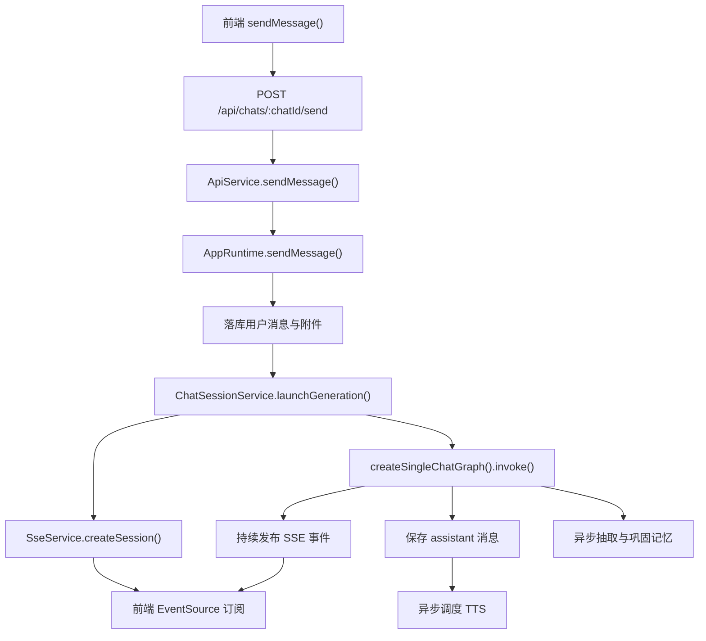
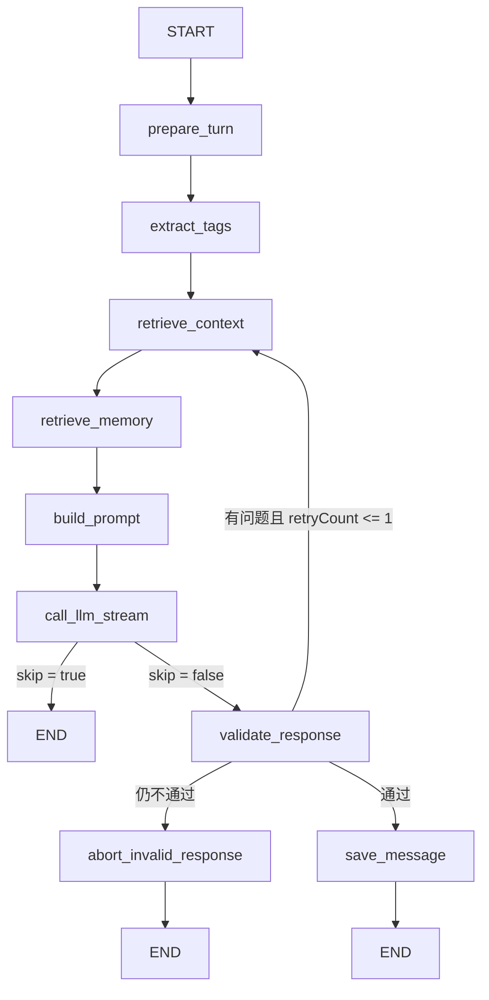

# 单聊调用链路

> 这份文档描述单聊消息从 HTTP 入口进入，到 LangGraph 执行、SSE 推流、记忆回写与 TTS 异步生成的完整链路。  
> 群聊请看 [group-chat-coordination.md](./group-chat-coordination.md)。

## 总览

## 入口链路

### 1. 前端发起请求

前端在 `useChatStream.sendMessage()` 中调用 `apiClient.sendMessage()`，把以下内容打包成 `multipart/form-data`：

- 文本内容 `content`
- 会话模式 `mode`
- 参与者 `participants`
- 可选附件 `attachments`

服务端入口在：

- [my-rp-chat-app/src/server/index.ts](/F:/SenrenTalk/my-rp-chat-app/src/server/index.ts:256)
- [my-rp-chat-app/src/renderer/hooks/useChatStream.ts](/F:/SenrenTalk/my-rp-chat-app/src/renderer/hooks/useChatStream.ts:271)

### 2. Express 路由解析请求

`POST /api/chats/:chatId/send` 这条路由负责：

- 用 `multer` 处理上传文件
- 解析 `participants` 与 `attachmentsMeta`
- 调用 `ApiService.sendMessage()`
- 在 `finally` 中清理临时上传文件

对应位置：

- [my-rp-chat-app/src/server/index.ts](/F:/SenrenTalk/my-rp-chat-app/src/server/index.ts:256)

### 3. ApiService 做并发控制与 Job 注册

`ApiService.sendMessage()` 先检查同一会话是否已有运行中的聊天任务，如果有则返回 `409`。  
通过检查后会：

- 创建 chat job
- 创建 `AbortController`
- 把生命周期 hook 传给 `AppRuntime.sendMessage()`

对应位置：

- [my-rp-chat-app/src/server/api-service.ts](/F:/SenrenTalk/my-rp-chat-app/src/server/api-service.ts:155)

### 4. AppRuntime 落库用户消息

`AppRuntime.sendMessage()` 是单聊与群聊共用的业务入口。对单聊来说，这一步主要做三件事：

- 校验会话存在
- 持久化附件到 `mediaDir`
- 把用户消息写入 SQLite

完成后调用 `ChatSessionService.launchGeneration()`，真正启动 AI 回复生成。

对应位置：

- [my-rp-chat-app/src/backend/app-runtime.ts](/F:/SenrenTalk/my-rp-chat-app/src/backend/app-runtime.ts:299)

### 5. ChatSessionService 启动流式会话

`ChatSessionService.launchGeneration()` 负责：

- 创建 SSE session，生成 `streamId` 与 `streamUrl`
- 组装初始 `state`
- 根据模式选择单聊图还是群聊协调器
- 把 LangSmith tracer、取消信号、后台任务跟踪器注入依赖

单聊场景会直接调用：

- `createSingleChatGraph(graphDependencies).invoke(state, config)`

对应位置：

- [my-rp-chat-app/src/backend/chat-session-service.ts](/F:/SenrenTalk/my-rp-chat-app/src/backend/chat-session-service.ts:41)

## 单聊 StateGraph

### Mermaid 流程图

实现入口：

- [my-rp-chat-app/src/backend/graph/chat-graphs.ts](/F:/SenrenTalk/my-rp-chat-app/src/backend/graph/chat-graphs.ts:930)

## 节点说明

### `prepare_turn`

职责：

- 计算当前说话角色 `currentRoleId`
- 读取 `CharacterProfile`
- 生成检索查询 `retrievalQuery`
- 清空上一轮输出缓冲
- 发布状态事件 `status`

这一层决定“谁在说话”和“后续检索围绕什么问题展开”。

位置：

- [chat-graphs.ts](/F:/SenrenTalk/my-rp-chat-app/src/backend/graph/chat-graphs.ts:703)

### `extract_tags`

职责：

- 调用 `llmService.extractTags()`
- 提取 scene / emotion / function / tone 等标签
- 为后续 ES 检索提供额外过滤和召回线索

标签抽取失败时会降级为空对象，不阻塞主流程。

位置：

- [chat-graphs.ts](/F:/SenrenTalk/my-rp-chat-app/src/backend/graph/chat-graphs.ts:727)

### `retrieve_context`

职责：

- 调用 `ElasticsearchService.hybridSearch()`
- 按当前角色过滤
- 混合向量检索、BM25 和标签匹配
- 返回 `retrievedDocs`

默认取 `topK: 10`，是角色设定与语料对话的主要上下文来源。

位置：

- [chat-graphs.ts](/F:/SenrenTalk/my-rp-chat-app/src/backend/graph/chat-graphs.ts:742)

### `retrieve_memory`

职责：

- 从 `memoryService.recall()` 召回长期记忆
- 从 `memoryService.getSummary()` 读取摘要记忆
- 从 `memoryService.getCoreMemory()` 读取核心记忆

这里读出的内容会一起注入后续 user prompt，但都被标记为“不可直接信任的参考资料”。

位置：

- [chat-graphs.ts](/F:/SenrenTalk/my-rp-chat-app/src/backend/graph/chat-graphs.ts:759)

### `build_prompt`

职责：

- 构造 system prompt
- 拼入角色身份、语气、自称、关系、禁止项
- 拼入群聊上下文或跨角色关系提示
- 保留 `antiRepeatInstruction` 等重写提示

这里的 system prompt 负责把“角色扮演边界”钉住。

位置：

- [chat-graphs.ts](/F:/SenrenTalk/my-rp-chat-app/src/backend/graph/chat-graphs.ts:780)

### `call_llm_stream`

职责：

- 构造 user prompt
- 读取图片附件并转成 base64 多模态输入
- 调用 `llmService.streamStructuredCompletion()`
- 持续发布 `token` 事件
- 返回结构化结果 `{ content, speechTextJa, nextSpeaker?, skip? }`

这个节点是前端逐字流式显示的来源。

位置：

- [chat-graphs.ts](/F:/SenrenTalk/my-rp-chat-app/src/backend/graph/chat-graphs.ts:806)

### `validate_response`

职责：

- 调用 `validateResponseIssues()`
- 检查 forbidden words、自称、图像身份一致性等规则
- 如果失败且 `retryCount <= 1`，回到 `retrieve_context` 重跑一次
- 如果仍失败，则进入 `abort_invalid_response`

注意这里的重试不是只重写一句，而是把检索、记忆、prompt、LLM 全链路再跑一遍。

位置：

- [chat-graphs.ts](/F:/SenrenTalk/my-rp-chat-app/src/backend/graph/chat-graphs.ts:850)

### `abort_invalid_response`

职责：

- 向前端推送 `error`
- 不保存 assistant 消息
- 结束本次图执行

位置：

- [chat-graphs.ts](/F:/SenrenTalk/my-rp-chat-app/src/backend/graph/chat-graphs.ts:862)

### `save_message`

职责：

- 组装 `ChatMessageMetadata`
- 把 assistant 消息写入 SQLite
- 推送 `message_done`
- 调度异步 TTS
- 返回更新后的消息历史

位置：

- [chat-graphs.ts](/F:/SenrenTalk/my-rp-chat-app/src/backend/graph/chat-graphs.ts:874)

## SSE 事件流

单聊过程中前端主要会收到这些事件：

- `status`：当前执行到哪个节点
- `token`：增量文本 token
- `message_done`：本条回复正式落库完成
- `audio_ready`：音频合成成功
- `audio_failed`：音频合成失败
- `error`：执行异常或校验终止

SSE session 由：

- [my-rp-chat-app/src/backend/services/stream/sse-service.ts](/F:/SenrenTalk/my-rp-chat-app/src/backend/services/stream/sse-service.ts:172)

统一管理。

## 记忆与 TTS 的收尾

### 记忆处理

单聊图执行完成后，`ChatSessionService` 会额外启动一个后台任务：

1. `memoryService.extractAndPersist()`
2. `memoryService.consolidateCoreMemory()`

它不阻塞首屏回复返回，但会被记入 `trackAsyncJob`，便于任务生命周期统一收口。

位置：

- [chat-session-service.ts](/F:/SenrenTalk/my-rp-chat-app/src/backend/chat-session-service.ts:124)

### TTS 处理

`save_message` 节点只负责调度，不会阻塞文本完成事件。  
真正的音频生成在 `scheduleAssistantAudio()` 中异步执行，成功后发送 `audio_ready`，失败则发送 `audio_failed`。

位置：

- [chat-graphs.ts](/F:/SenrenTalk/my-rp-chat-app/src/backend/graph/chat-graphs.ts:654)

## 编辑后重生成

`POST /api/messages/:messageId/edit-and-regenerate` 走的是同一条单聊调用链，只是入口前多了一步：

- 更新被编辑的用户消息
- 截断该消息之后的全部历史
- 清空会话记忆与相关媒体
- 再次调用 `launchGeneration()`

位置：

- [my-rp-chat-app/src/backend/app-runtime.ts](/F:/SenrenTalk/my-rp-chat-app/src/backend/app-runtime.ts:345)

## 与群聊的关系

单聊图不是“单聊专用实现”，而是“单个角色的一次发言执行单元”。  
群聊协调器本质上就是在外层循环里，反复调用这张图，并为每次调用补充：

- `groupContext`
- `currentRound`
- `turnIndex`
- `replyToMessageId`
- `replyToRoleId`
- `generationReason`
- `antiRepeatInstruction`

所以理解单聊图，是理解群聊协调器的前置条件。
