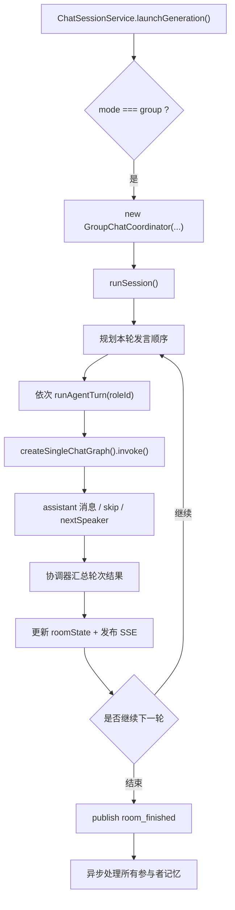
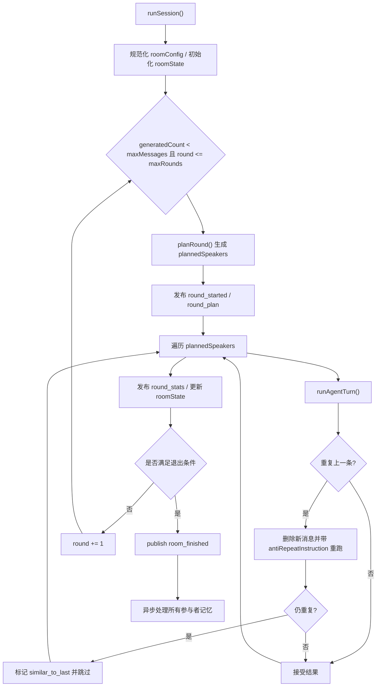

# 群聊协调说明

> 这份文档描述 `GroupChatCoordinator` 如何把多个角色的单次发言组织成一轮群聊。  
> 单个角色内部那张图请先看 [agent-call-chain.md](./agent-call-chain.md)。

## 核心结论

`GroupChatCoordinator` 并不自己“生成回复文本”。  
它真正做的是：

- 决定这一轮谁先说、谁后说
- 为每个角色补充群聊上下文
- 调用单角色 `StateGraph`
- 处理跳过、失败、重试改写与反复读保护
- 维护房间状态与 SSE 事件

可以把它理解成“房间调度器”，而不是“另一个大模型图”。

## 总览图

## 入口位置

群聊入口由 `ChatSessionService.launchGeneration()` 选择：

- [my-rp-chat-app/src/backend/chat-session-service.ts](/F:/SenrenTalk/my-rp-chat-app/src/backend/chat-session-service.ts:94)

当 `request.mode === "group"` 时，会：

1. 创建 `GroupChatCoordinator`
2. 把 `chat.roomConfig` 注入进去
3. 调用 `runSession()`

## 为什么要先重排参与者顺序

在真正进入协调器之前，`launchGeneration()` 会先根据：

- `request.targetRoleId`
- `request.mentionTarget`

重排 `orderedParticipants`，把被点名角色放到最前面。这样做的目的是：

- 让群聊入口和房间状态保持一致
- 让“定向回复”更稳定
- 避免前端指定目标角色后，第一位发言者仍是其他人

位置：

- [chat-session-service.ts](/F:/SenrenTalk/my-rp-chat-app/src/backend/chat-session-service.ts:47)

## `runSession()` 的主循环

### Mermaid 主循环

实现位置：

- [my-rp-chat-app/src/backend/graph/group-coordinator.ts](/F:/SenrenTalk/my-rp-chat-app/src/backend/graph/group-coordinator.ts:479)

## 房间配置的真实含义

### `mode`

支持三种模式：

- `single_round`：只跑一轮；每个参与角色本轮最多发言一次
- `free_chat`：可以继续多轮，但受 `maxRounds`、`maxMessages`、`idleStreakThreshold` 约束
- `host_mode`：主持角色优先，其余角色跟随

### `targetRoleId`

表示当前这轮是否定向让某个角色先回应。  
它会同时影响：

- 参与者顺序
- `planRound()` 结果
- `replyToRoleId`
- `groupContext` 内容
- 最终的 `generationReason`

### `maxRounds` 与 `maxMessages`

- `maxRounds` 控制最多轮数
- `maxMessages` 控制整场群聊允许生成的 assistant 消息总数

从当前实现看，`single_round` 模式会被统一规范化为：

- `maxRounds = 1`
- `maxMessages <= 参与者数`

位置：

- [my-rp-chat-app/src/common/types.ts](/F:/SenrenTalk/my-rp-chat-app/src/common/types.ts:408)

## `planRound()` 如何决定本轮顺序

`planRound()` 是群聊最关键的排序器之一。

规则如下：

### 1. `host_mode`

如果是主持模式：

- 先找 `hostRoleId`
- 主持人排第一
- 其余参与者依次排后

### 2. 有 `targetRoleId`

如果本轮有定向目标：

- 目标角色排第一
- 其余角色按原顺序接在后面

### 3. `single_round`

如果是单轮模式且没有定向目标：

- 直接按参与者顺序全部说一轮

### 4. `speakerPolicy === "round_robin"`

如果是自由群聊且使用轮转策略：

- 每轮都按 round 偏移一个起点

### 5. 默认行为

- 原顺序发言

位置：

- [group-coordinator.ts](/F:/SenrenTalk/my-rp-chat-app/src/backend/graph/group-coordinator.ts:161)

## `runAgentTurn()` 在做什么

`runAgentTurn()` 负责把“房间级上下文”转成“单角色可执行状态”。

它会组装：

- `groupContext`
- `replyToMessageId`
- `replyToRoleId`
- `currentRound`
- `turnIndex`
- `generationReason`
- `antiRepeatInstruction`

然后调用：

- `createSingleChatGraph(...).invoke(state, config)`

这意味着群聊里的每次角色发言，底层仍然完整经过：

1. 检索
2. 记忆
3. prompt 构建
4. LLM 流式生成
5. 校验
6. 保存

位置：

- [group-coordinator.ts](/F:/SenrenTalk/my-rp-chat-app/src/backend/graph/group-coordinator.ts:196)

## `groupContext` 里放了什么

协调器会把下面这些内容写进 `groupContext`：

- 房间模式
- 参与角色列表
- 当前说话角色
- 当前轮次
- 可选 topic / scene
- 可选 targetRoleId
- 最近 8 条消息
- 可选 anti-repeat 提示

并且会根据模式补一句额外约束：

- `single_round`：这一轮说完不要再主动拉下一轮
- `host_mode`：主持人优先或优先回应主持人
- `free_chat`：可以指定 `nextSpeaker`，但不要无意义续聊

位置：

- [group-coordinator.ts](/F:/SenrenTalk/my-rp-chat-app/src/backend/graph/group-coordinator.ts:86)

## 反复读保护

这是当前群聊体验里很重要的一层兜底。

### 第一步：比较本角色上一条 assistant 消息

协调器会取同一角色上一条已保存的 assistant 消息，与这次新生成内容比较：

- 去空白
- 去标点
- 转小写
- 短文本再做包含判断

位置：

- [group-coordinator.ts](/F:/SenrenTalk/my-rp-chat-app/src/backend/graph/group-coordinator.ts:14)

### 第二步：如果重复，删掉新消息并重跑

一旦检测到“和自己上一条太像”，会：

1. 删除刚落库的新消息
2. 恢复 `sharedHistory`
3. 带上 `antiRepeatInstruction` 再执行一次该角色发言

使用的提示是：

- “不要重复你刚刚说过的内容，请补充新信息或换一个角度回应。”

### 第三步：如果重跑后还是重复，直接跳过

如果第二次还是和上一条过于相似：

1. 再次删除新消息
2. 本轮改判为 `skip`
3. `skipReason = "similar_to_last"`
4. 发布 `role_skipped`

这能避免群聊里出现“同一角色换皮复读”。

位置：

- [group-coordinator.ts](/F:/SenrenTalk/my-rp-chat-app/src/backend/graph/group-coordinator.ts:551)

## 跳过与失败的处理

### 模型主动跳过

如果单角色图返回 `skip = true`：

- 不保存 assistant 消息
- 记录 `skipReason`
- 发布 `role_skipped`

### 角色执行失败

如果某个角色在执行过程中抛错：

- 本角色记入 `roundFailed`
- 发布带 `roleId` 的 `error`
- 不影响本轮其他角色继续执行

这意味着群聊对单角色失败具备一定容错能力。

位置：

- [group-coordinator.ts](/F:/SenrenTalk/my-rp-chat-app/src/backend/graph/group-coordinator.ts:611)

## 轮次级 SSE 事件

群聊在单角色 `status/token/message_done` 之外，还会额外发这些房间级事件：

- `round_started`
- `round_plan`
- `round_stats`
- `role_skipped`
- `room_finished`

前端可以据此渲染：

- 当前第几轮
- 计划由谁发言
- 谁跳过了
- 本轮为什么结束

对应位置：

- [group-coordinator.ts](/F:/SenrenTalk/my-rp-chat-app/src/backend/graph/group-coordinator.ts:521)

## 房间状态如何落库

协调器每轮都会更新 `roomState`，主要字段包括：

- `currentRound`
- `currentTurn`
- `plannedSpeakers`
- `lastSpeakers`
- `skippedRoles`
- `lastFinishedReason`
- `lastTargetRoleId`

这样做的好处是：

- 刷新页面后还能知道房间最近一次运行到哪里
- 前端切模式、切定向目标时能和后端状态保持一致

位置：

- [group-coordinator.ts](/F:/SenrenTalk/my-rp-chat-app/src/backend/graph/group-coordinator.ts:535)

## 退出条件

当前 `runSession()` 可能因为以下原因结束：

### `single_round`

- 本轮说完即结束
- 若有 `targetRoleId`，结束原因通常是“仅定向角色回复”

### 空转过多

- 当一整轮没有实际 speaker 成功发言时，`idleStreak += 1`
- 达到 `idleStreakThreshold` 后结束

### 预算耗尽

- `generatedCount >= maxMessages`

### 轮数上限

- `round >= maxRounds`

对应结束原因会写入：

- `roomState.lastFinishedReason`
- `room_finished.reason`

位置：

- [group-coordinator.ts](/F:/SenrenTalk/my-rp-chat-app/src/backend/graph/group-coordinator.ts:667)

## 记忆处理

群聊结束后，协调器会对所有参与者并行执行：

1. `memoryService.extractAndPersist(chatId, character, finalHistory)`
2. `memoryService.consolidateCoreMemory(chatId, character)`

这里是并行的，不是串行的。

位置：

- [group-coordinator.ts](/F:/SenrenTalk/my-rp-chat-app/src/backend/graph/group-coordinator.ts:329)

## 兼容旧实现的 `runLegacySession()`

类里还保留了一条旧路径 `runLegacySession()`，用于兼容早期通过数字参数构造协调器的调用方式。  
新逻辑以 `runSession()` 为主，文档和后续维护都应以新路径为准。

位置：

- [group-coordinator.ts](/F:/SenrenTalk/my-rp-chat-app/src/backend/graph/group-coordinator.ts:345)

## 建议的阅读顺序

如果之后还要继续完善群聊文档，建议按这个顺序读代码：

1. [chat-session-service.ts](/F:/SenrenTalk/my-rp-chat-app/src/backend/chat-session-service.ts:41)
2. [group-coordinator.ts](/F:/SenrenTalk/my-rp-chat-app/src/backend/graph/group-coordinator.ts:1)
3. [chat-graphs.ts](/F:/SenrenTalk/my-rp-chat-app/src/backend/graph/chat-graphs.ts:703)
4. [useChatStream.ts](/F:/SenrenTalk/my-rp-chat-app/src/renderer/hooks/useChatStream.ts:33)

这样最容易把“房间调度”和“单角色发言”两层脑图分开。
